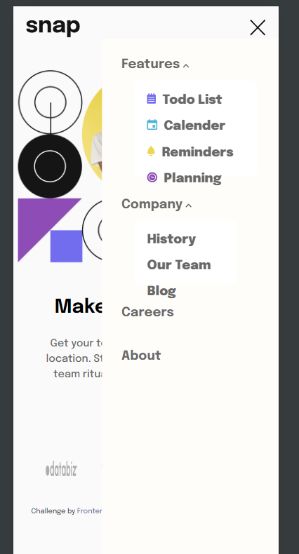

# Frontend Mentor - Intro section with dropdown navigation solution

This is a solution to the [Intro section with dropdown navigation challenge on Frontend Mentor](https://www.frontendmentor.io/challenges/intro-section-with-dropdown-navigation-ryaPetHE5). Frontend Mentor challenges help you improve your coding skills by building realistic projects. 

## Table of contents

- [Overview](#overview)
  - [The challenge](#the-challenge)
  - [Screenshot](#screenshot)
  - [Links](#links)
- [My process](#my-process)
  - [Built with](#built-with)

- [Author](#author)

## Overview

### The challenge

Users should be able to:

- View the relevant dropdown menus on desktop and mobile when interacting with the navigation links
- View the optimal layout for the content depending on their device's screen size
- See hover states for all interactive elements on the page

### Screenshot

### Links

- Solution URL: [code](https://github.com/Ehmkayel/Intro-section-)
- Live Site URL: [Live site](https://spiffy-puppy-b9806c.netlify.app/)

### Built with

- Semantic HTML5 markup
- CSS custom properties
- Flexbox
- BEM Methodolgy
- Mobile-first workflow
- Javascript

## Author

- Github - [Morufat](github.com/Ehmkayel)
- Linkedin - [Morufat](https://www.linkedin.com/in/morufat-lamidi/)
- Frontend Mentor - [@Ehmkayel](https://www.frontendmentor.io/profile/Ehmkayel)
- Twitter - [@kamalehmk](https://www.twitter.com/kamalehmk)

