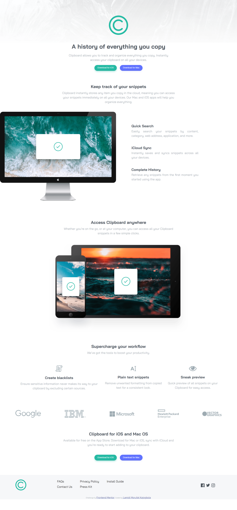
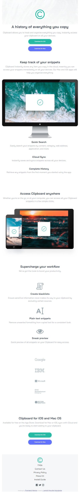
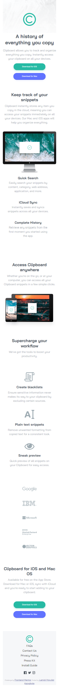

# Frontend Mentor - Clipboard landing page solution

This is a solution to the [Clipboard landing page challenge on Frontend Mentor](https://www.frontendmentor.io/challenges/clipboard-landing-page-5cc9bccd6c4c91111378ecb9). Frontend Mentor challenges help you improve your coding skills by building realistic projects. 

## Table of contents

- [Overview](#overview)
  - [The challenge](#the-challenge)
  - [Screenshot](#screenshot)
  - [Links](#links)
- [My process](#my-process)
  - [Built with](#built-with)
- [Author](#author)

## Overview

### The challenge

Users should be able to:

- View the optimal layout for the site depending on their device's screen size
- See hover states for all interactive elements on the page

### Screenshot

### Links

- Solution URL: [code](https://github.com/Ehmkayel/frontendmentorchallenges/tree/main/clipboard-landing-page-master)
- Live Site URL: [Clipboard live site](https://frontendmentorchallenges-ju9v.vercel.app/)

## My process

### Built with

- Semantic HTML5 markup
- CSS custom properties
- Flexbox
- CSS Grid
- Css Variables
- Media queries

## Author
- Website - [github](github.com/Ehmkayel)
- Linkedin - [Morufat](https://www.linkedin.com/in/morufat-lamidi/)
- Frontend Mentor - [@Ehmkayel](https://www.frontendmentor.io/profile/Ehmkayel)
- Twitter - [@kamalehmk](https://www.twitter.com/kamalehmk)

