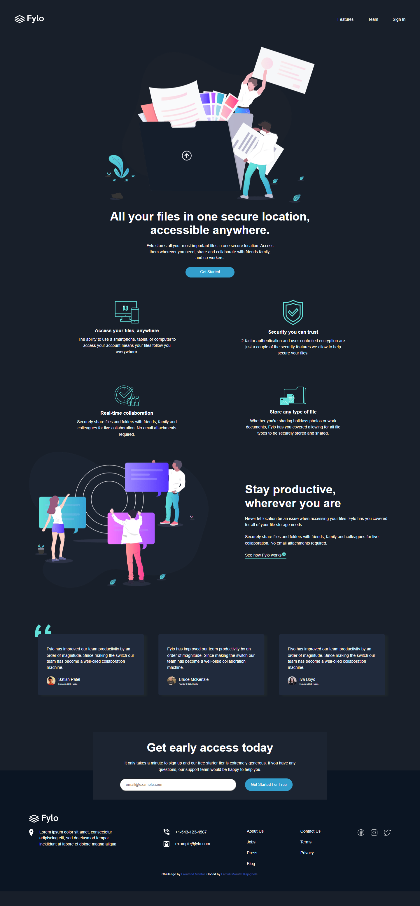
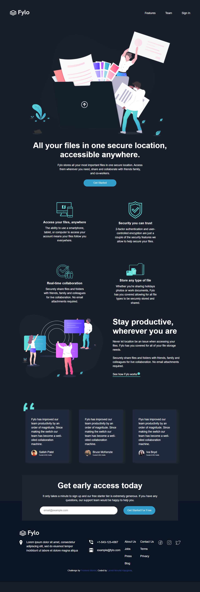
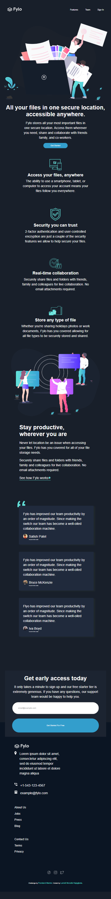
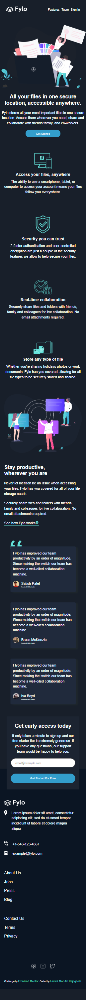

# Frontend Mentor - Fylo dark theme landing page solution

This is a solution to the [Fylo dark theme landing page challenge on Frontend Mentor](https://www.frontendmentor.io/challenges/fylo-dark-theme-landing-page-5ca5f2d21e82137ec91a50fd). Frontend Mentor challenges help you improve your coding skills by building realistic projects. 

## Table of contents

- [Overview](#overview)
  - [The challenge](#the-challenge)
  - [Screenshot](#screenshot)
  - [Links](#links)
- [My process](#my-process)
  - [Built with](#built-with)
  - [What I learned](#what-i-learned)
  
- [Author](#author)

## Overview

### The challenge

Users should be able to:

- View the optimal layout for the site depending on their device's screen size
- See hover states for all interactive elements on the page

### Screenshot

### Links

- Solution URL: [code](https://github.com/Ehmkayel/frontendmentorchallenges/tree/main/fylo-dark-theme-landing-page-master)
- Live Site URL: [Flyo landing page dark theme](https://cute-gecko-ae3885.netlify.app/)

## My process

### Built with

- Semantic HTML5 markup
- CSS custom properties
- Flexbox
- CSS Grid
- BEM Methodologies
- Media queries

## Author

- Website - [github](github.com/Ehmkayel)
- Linkedin - [Morufat](https://www.linkedin.com/in/morufat-lamidi/)
- Frontend Mentor - [@Ehmkayel](https://www.frontendmentor.io/profile/Ehmkayel)
- Twitter - [@kamalehmk](https://www.twitter.com/kamalehmk)

