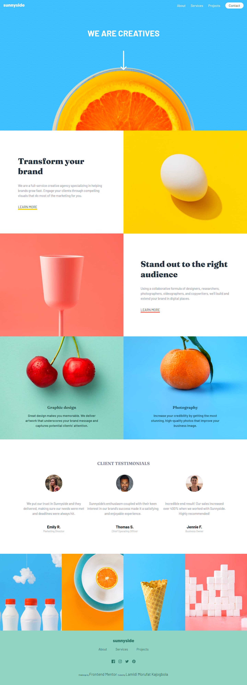
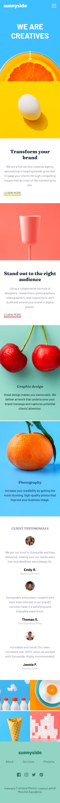

# Frontend Mentor - Sunnyside Agency Landing page

This is a solution to the [Sunnyside agency Landing  page challenge on Frontend Mentor](https://www.frontendmentor.io/challenges/sunnyside-agency-landing-page-7yVs3B6ef). Frontend Mentor challenges help you improve your coding skills by building realistic projects. 

## Table of contents

- [Overview](#overview)
  - [The challenge](#the-challenge)
  - [Screenshot](#screenshot)
  - [Links](#links)

  - [Built with](#built-with)
 
- [Author](#author)

## Overview

### Screenshot

### Links

- Solution URL: [code](https://github.com/Ehmkayel/frontendmentorchallenges/tree/main/sunnyside-agency-landing-page-main)
- Live Site URL: [Sunnyside Landing page]()

## My process

### Built with

- Semantic HTML5 markup
- CSS custom properties
- media queries
- css grid
- js

## Author

- Website - [github](github.com/Ehmkayel)
- Linkedin - [Morufat](https://www.linkedin.com/in/morufat-lamidi/)
- Frontend Mentor - [@Ehmkayel](https://www.frontendmentor.io/profile/Ehmkayel)
- Twitter - [@kamalehmk](https://www.twitter.com/kamalehmk)

